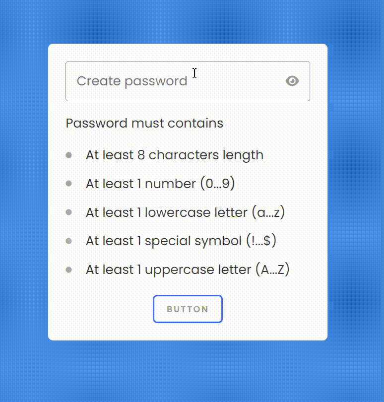

# Password Validation Form
This project is the first in a series of 30 small JavaScript projects aimed at enhancing my front-end development skills. 
This project is a simple password validation form built using HTML, CSS, and JavaScript. The form provides real-time feedback on the strength of the password based on specific criteria.

## Features

- At least 8 characters in length.
- At least 1 number (0-9).
- At least 1 lowercase letter (a-z).
- At least 1 special symbol (!, @, #, $, etc.).
- At least 1 uppercase letter (A-Z).

## Real-Time Feedback

As the user types, each requirement is validated and visually indicated with a checkmark or a dot. The form updates instantly, showing which requirements are met and which are not.

## Screenshot

## Technologies Used

- **HTML**: For the structure of the form.
- **CSS**: For styling the form and validation indicators.
- **JavaScript**: For handling the real-time validation of the password.
